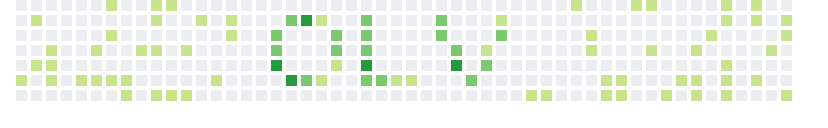

  

<h2></h2>

 **i  work with** `.py`, `.js`, `.html`, `.css`, `.lua`, **and** `.cpp`  
 **currently** working on personal projects  
 **learning** `.java`, `.ts`, `.php`, `.cs`, `.ruby`, **and**, `.go` 

 
 ⚙️ tools & technologies 

  
   
  
  
  
  
  
   
  
  
  
  
  
  
  
   
  
  
  
  
  
    
 

 

 

